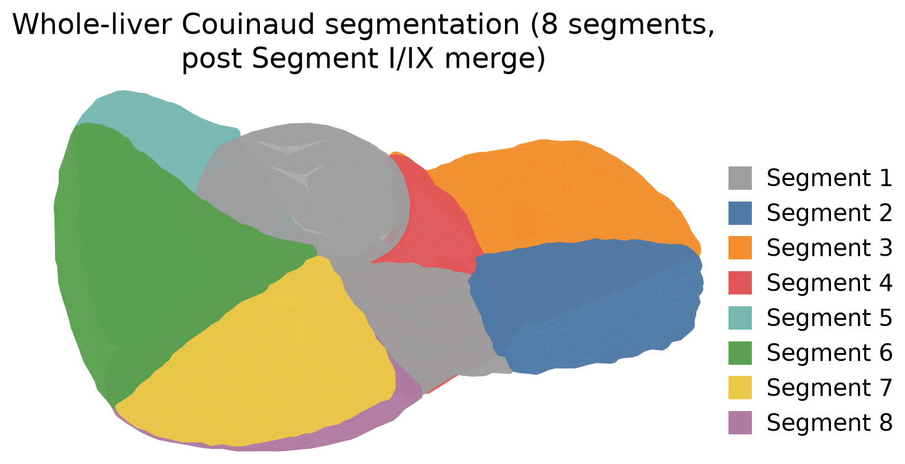
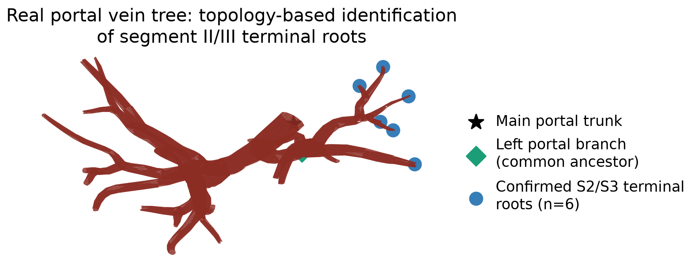
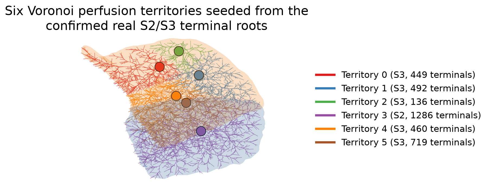
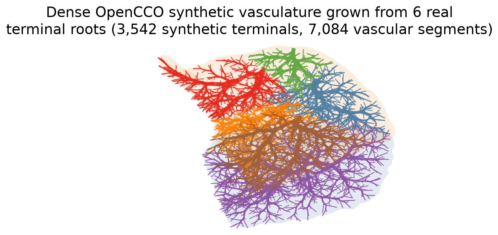
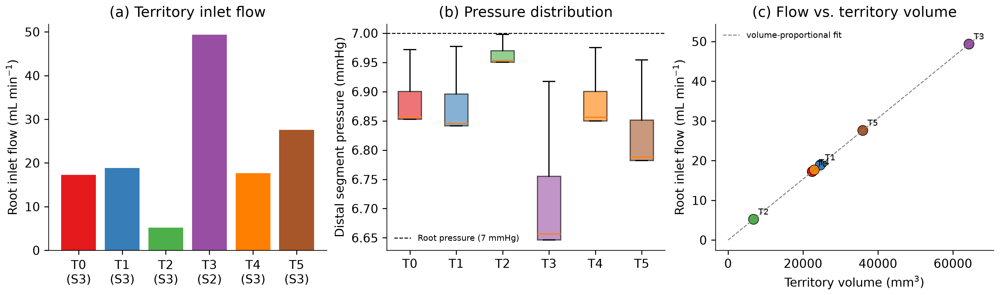

# Vascularly Constrained Meso-Units: Bridging Macro-Scale Liver Anatomy and the Hepatic Microcirculation

**Target:** Journal of Biomechanics, Special Issue "Virtual Twins of Human Organ Systems" (submission deadline 31 Dec 2026, article type "VSI: Virtual Twins")

**Authors:** Harvey Ho¹, [co-authors TBD]
¹ [affiliation — AUTHOR TO COMPLETE]

**Status:** Second draft. Sections and statements marked **[AUTHOR TO COMPLETE]** require information only the author has (imaging provenance, ethics approval, institutional detail, co-author input) and must not be filled from assumption. Statements marked **[AUTHOR TO VERIFY]** flag a citation or claim that a literature search could not fully confirm and that should be checked against the primary source before submission. Numerical results throughout are taken directly from the computational pipeline described in `virtual_twin_pipeline/` in this repository and are reproducible from the scripts and data there. All five figures are rendered directly from that same pipeline data (`scripts/make_figures.py`), not illustrative mockups. All in-text citations and the reference list were populated from a live literature search (not model memory); two flagged items ([AUTHOR TO VERIFY]) could not be fully confirmed against a primary source and should be checked before submission.

---

## Abstract

Virtual twins of the liver for surgical and transplant planning typically resolve vasculature down to the limit of clinical imaging — hundreds of branch generations short of the organ's true functional unit, the hepatic lobule (~10⁶ per adult liver, ~1–1.5 mm³ each). Existing approaches either stop at this imaging-resolved, coarse vascular-territory scale, or homogenize the whole organ into a continuum with no discrete vessel geometry, or bridge to the microcirculation using idealized, non-patient-specific microvascular surrogates. We propose a *vascularly constrained functional macro-unit* framework that extends real, patient-specific portal vasculature — identified not by spatial proximity but by tracing vessel-graph topology from the main portal trunk — into meso-scale synthetic sub-trees confined to the true segmented tissue volume, using Constrained Constructive Optimization (CCO). Each meso-unit terminal carries an explicit flow and pressure, computed from a Poiseuille resistance-network solve driven by literature portal-venous physiology, forming a direct boundary-condition interface for future lobule-scale coupling. We demonstrate the framework on Couinaud segments II and III — the standard graft in adult-to-infant living-donor liver transplantation — starting from 6 real portal terminal branches identified via graph-topology tracing (verified, not assumed, to lie within the true tissue volume) and extending them to 3,542 synthetic terminals (7,084 vascular segments) confined within 97.5% strict geometric accuracy to the true segment volume. The resulting terminal density (~25–35 lobules represented per meso-unit) is independently consistent with a recently published organ-to-lobule model that arrived at a comparable resolution by a different route. We report the full pipeline, its verification methodology, current limitations — including an as-yet-unresolved directional-growth artifact in the synthetic vasculature and the absence of the lobule-scale physics layer and experimental validation — and the concrete steps required to close them.

**Keywords:** virtual twin; liver; multiscale modeling; vascular tree growth; constrained constructive optimization; portal hemodynamics; Couinaud segments

---

## 1. Introduction

[AUTHOR TO COMPLETE / EXPAND — the paragraphs below are a structural draft, not a literature-complete introduction. In-text citations below have been populated with real, independently verified references (see References); please sanity-check the framing against the primary sources before submission, since a first-draft literature pass can misrepresent nuance even when the citations themselves are correct.]

Liver resection and living-donor transplant planning rely increasingly on patient-specific 3D models built from CT or MR imaging, segmented into the eight Couinaud functional segments and their supplying/draining vasculature (Couinaud, 1957; Strasberg, 2005). These models support volumetric planning — predicting remnant liver volume and remnant-to-body-weight ratio — but volume alone is an incomplete predictor of postoperative outcome: post-hepatectomy liver failure and small-for-size syndrome are understood to depend on functional hepatic reserve, not remnant volume in isolation (Dahm et al., 2005; Rahbari et al., 2011). Functional reserve is a lobule-scale property — it depends on local perfusion, oxygen delivery, and metabolic zonation across the ~10⁶ hepatic lobules of the adult liver (Lorente et al., 2020) — a scale that is four to five orders of magnitude finer than anything resolvable in clinical imaging or its derived vascular models.

Bridging this gap is the explicit ambition of recent multiscale liver modeling work. Two recent approaches illustrate the range of strategies. A dual-continuum upscaling approach (Coombe et al., 2022) homogenizes tissue and vasculature into two coupled continuum fields and upscales through three grid resolutions to a full-organ model with 1,435,038 active lobule-scale grid blocks, at the cost of discarding explicit vessel geometry entirely. A 2025 organ-to-lobule framework (Malka-Markovitz et al., 2025) instead couples patient-specific portal CFD to lobule-scale drug-injury physics via a Constrained Constructive Optimization (CCO) "capillary surrogate" generating on the order of 10,000 vascular outlets (spanning a 1.5 mm inlet diameter down to outlets as small as 50 µm), and separately represents the liver's ~1.5 million real lobules using ~100,000 microscale lobule computational units — a ~15:1 real-lobule-to-model-unit ratio — but using simplified two-dimensional capillary geometry, a limitation the authors themselves note.

We take a third path, oriented toward surgical planning rather than pharmacokinetics, and toward explicit three-dimensional geometry throughout. We introduce the *vascularly constrained functional macro-unit* (hereafter, at the scale addressed in this paper, the *meso-unit*): a computational container — not a claimed anatomical structure — that represents the unresolved population of lobules supplied by one real, imaged terminal vascular branch, extended by a synthetic three-dimensional vascular tree confined to the true segmented tissue volume, and carrying an explicit flow/pressure state at every terminal. The central methodological contribution of this paper is not the use of CCO itself — which is well established (Schreiner and Buxbaum, 1993; Karch et al., 1999; Kerautret et al., 2023) — but three things done around it that, to our knowledge, are not addressed together elsewhere: (i) identifying which real vascular branches genuinely supply a target anatomical region by tracing vessel-graph *topology* from the organ's vascular root, rather than by spatial proximity, which we show below gives a materially different and more defensible answer; (ii) confining synthetic growth to the *true*, patient-specific segmented tissue volume via a voxelized domain constraint, with the resulting geometric fidelity independently verified by point-in-mesh containment testing rather than assumed; and (iii) deriving physiologically-scaled flow and pressure at every synthetic terminal, explicitly for use as the macro-to-meso boundary-condition interface of a future lobule-scale coupling, rather than as an end in itself.

We demonstrate the framework on Couinaud segments II and III of a [AUTHOR TO COMPLETE: patient/source] liver — the left lateral segment, the standard graft in adult-to-infant living-donor liver transplantation (Broelsch et al., 1991) and therefore a clinically motivated and computationally tractable test region — and report the framework's current capabilities, its independent verification against ground-truth geometry, and its limitations candidly, consistent with this special issue's emphasis on model validation as a precondition for clinical translation of virtual human twins.

## 2. Methods

### 2.1 Source anatomy and segmentation

[AUTHOR TO COMPLETE] The patient-specific liver model comprises the eight Couinaud segments and four accompanying tree structures — the portal vein, hepatic artery, hepatic vein, and biliary tree — previously segmented from [imaging modality, e.g. contrast-enhanced CT/MR — TO CONFIRM] and represented as triangulated surface meshes. [Ethics/IRB approval statement, patient consent statement, and any de-identification statement to be added here.]

During preprocessing we identified that the source dataset's Segment I (caudate lobe) was represented as two separate mesh regions ("S1" and "S9"). We resolved this by tracing geodesic distance along the portal vein's own triangulated surface (rather than Euclidean straight-line distance, which cuts through tissue) from each region's nearest portal-vein contact point back to the shared trunk; S9's nearest-approach point was topologically closer to S1's than to any other segment's, consistent with S9 representing a split sub-region of the caudate lobe in this dataset. The two regions were merged into a single Segment I for all subsequent analysis. The resulting eight-segment whole-liver volume, computed by the divergence theorem on each segment's closed triangulated surface and cross-validated against an independent mesh-volume implementation (`trimesh`), is **1,433,320 mm³** (Table 1).

**Table 1.** Couinaud segment volumes (post Segment I/IX merge).

| Segment | Volume (mm³) |
|---|---|
| I (merged) | 211,992 |
| II | 71,169 |
| III | 108,013 |
| IV | 146,829 |
| V | 197,175 |
| VI | 212,707 |
| VII | 123,632 |
| VIII | 361,804 |
| **Total** | **1,433,320** |

**Figure 1.** Whole-liver Couinaud segmentation used in this study, after merging the source dataset's split Segment I representation ("S1"/"S9") into a single Segment I (§2.1). Rendered directly from the compact triangulated-surface geometry in `data/S1.json`–`data/S8.json`.

### 2.2 Vessel skeletonization

Each vascular tree's surface mesh, on inspection, was found to consist not of one connected tube surface but of 17–86 disconnected triangulated tube fragments ("tubelets") per tree — an artifact of the source segmentation pipeline. We reconstructed a proper skeleton graph from this fragmented representation as follows: for each tubelet, its two end-ring centroids were estimated from the extremal percentiles of vertex positions projected onto the tubelet's principal axis (via singular value decomposition); these endpoints, pooled across all tubelets in a tree, were then merged into unified graph nodes by proximity clustering at a tuned bridging radius (selected per tree by sweeping radius and tracking the resulting node/leaf/branch-point counts until full single-component connectivity was achieved without over-merging distinct branch points). Each tubelet became one graph edge, carrying its mean cross-sectional radius (estimated from the perpendicular spread of its vertices about the principal axis). This produced, for the portal vein tree, a connected graph of 69 nodes at a bridging radius of 6 mm (the radius used for the topology-tracing analysis in §2.3).

### 2.3 Topology-based identification of perfusion territories

A recurring risk in linking anatomical segments to their supplying vessels is spatial-proximity assignment — associating a vessel terminal with the nearest segment surface — which can misattribute a branch that merely passes near a segment without perfusing it. We instead traced the portal vein skeleton graph's topology directly. The main portal trunk was identified as the leaf node with the largest incident vessel radius (trunk tubelets are markedly thicker than terminal tubelets; the trunk radius was 6.21 mm against a median leaf radius of 2.05 mm). A breadth-first search from this trunk established a parent–child hierarchy over the full graph. For each terminal leaf within a threshold distance of the target segments (II and III), we computed its full path back to the trunk, and found the deepest node common to *all* such paths — the graph-theoretic equivalent of the anatomical "left portal branch." Six terminal leaves passed this topology criterion (one supplying segment II, five supplying segment III); we independently verified, by point-in-mesh containment testing against the true segmented surface (not proximity), that all six lie genuinely inside the segment II/III tissue volume rather than merely near it. Their shared ancestor's subtree was also found to include leaves near segments I and IV, consistent with the true anatomical left portal branch supplying segments II, III, and IV rather than II/III in isolation — an internal anatomical consistency check on the method, not an artifact requiring correction.

**Figure 2.** Real portal vein skeleton graph (reconstructed per §2.2) with the main portal trunk, the left-portal-branch common ancestor, and the six topology-confirmed segment II/III terminal roots identified by the method of §2.3.

### 2.4 Meso-scale vascular synthesis

Each of the six confirmed terminals seeds one meso-scale synthetic sub-tree, grown by [OpenCCO](https://github.com/OpenCCO-team/OpenCCO) (Kerautret et al., 2023), an open-source implementation of Constrained Constructive Optimization (Schreiner and Buxbaum, 1993; Karch et al., 1999) built from source for this work. Each sub-tree's growth domain is its own perfusion territory: the segment II/III tissue volume, voxelized at 1.5 mm resolution via point-in-mesh testing (`trimesh`), tessellated by nearest-terminal assignment (a discrete Voronoi partition) among the six confirmed roots, and written as a DGtal `.vol` binary mask (OpenCCO's native domain format). Growth is therefore confined to real, patient-specific tissue rather than an implicit sphere or box. Terminal count per territory was set to target a fixed synthetic-terminal density of 50 mm³ per terminal, yielding territory-proportional terminal counts (Table 2) and a combined 3,542 synthetic terminals across the six territories (7,084 vascular segments, corresponding to 10–12 branch generations beyond the six real roots). OpenCCO computes each new segment's radius via its own internal Poiseuille/Murray's-law-consistent, intravascular-volume-minimizing optimization; these radii were retained as-is. OpenCCO's own internal flow, pressure, and resistance bookkeeping, by contrast, were found on inspection of its source and output to be unmodified constants carried over from its original coronary-artery demonstration case (`my_pPerf = 13300`, `my_pTerm = 8400`, `my_qPerf = 8330`, unchanged regardless of the perfusion-volume and terminal-count arguments supplied) and were therefore discarded in favor of the independent hemodynamic solve described in §2.5.

**Table 2.** Meso-unit vascular synthesis per territory.

| Territory | Segment | Territory volume (mm³) | Synthetic terminals | Vascular segments |
|---|---|---|---|---|
| 1 | III | 22,461 | 449 | 898 |
| 2 | III | 24,590 | 492 | 984 |
| 3 | III | 6,797 | 136 | 272 |
| 4 | II | 64,290 | 1,286 | 2,572 |
| 5 | III | 22,980 | 460 | 920 |
| 6 | III | 35,950 | 719 | 1,438 |
| **Total** | | **177,068** | **3,542** | **7,084** |

The sum of Voronoi territory volumes (177,068 mm³) agrees with the independently computed true segment II + III volume (179,182 mm³; Table 1) to within 1.2%, the expected discretization error of the 1.5 mm voxel grid — a first internal consistency check on the domain construction.

**Figure 3.** The six Voronoi perfusion territories tessellating the segment II/III tissue volume, each seeded from one of the confirmed real terminal roots of Figure 2, shown here already populated with their synthesized OpenCCO sub-trees (§2.4).

**Figure 4.** The complete dense synthetic vascular network (3,542 terminals, 7,084 segments; Table 2) grown by OpenCCO from the six real terminal roots, confined to the true segment II/III tissue volume and colored by territory.

During development we identified and corrected a coordinate-system defect in the domain-construction pipeline: DGtal's `.vol` reader places a voxel domain's first index at `Center − (dim − 1)/2` for whatever `Center` header value is supplied, not at the origin, for any `Center` value; our initial implementation wrote `Center = (0,0,0)` uniformly, which silently displaced each territory's true domain origin by roughly half that territory's own extent, and correspondingly allowed synthetic growth up to several centimeters outside the true tissue volume. Correcting the header calculation (`Center = (dim − 1)//2`, placing the domain origin at the intended index) and re-verifying by point-in-mesh containment testing (rather than trusting the fix by construction) confirmed that 97.5% of synthetic vascular node endpoints now lie strictly inside the true segmented mesh, with the residual 2.5% within 0.8 mm of the surface — consistent with, and not exceeding, the 1.5 mm voxel discretization scale, i.e. not a residual geometric error. We report this defect and its correction explicitly because it is the kind of silent, plausible-looking failure mode that independent geometric verification — rather than visual inspection alone — is needed to catch, and because it is a property of the third-party domain-format convention rather than of our own geometric method.

### 2.5 Hemodynamic network solve

OpenCCO's synthesized radii were combined with an independently derived flow and pressure field, computed as a resistance network under standard Poiseuille assumptions, using literature portal-venous physiology rather than OpenCCO's internal (coronary-artery-derived) constants. Each territory's root inlet flow was assigned proportional to that territory's fraction of total liver volume (Table 1), out of a literature total portal venous flow of 1100 mL min⁻¹, within the commonly cited ~800–1200 mL min⁻¹ physiological range for resting adult portal flow (Eipel et al., 2010); this is a uniform-perfusion-per-unit-volume assumption, adopted in the absence of patient-specific perfusion imaging. Flow was split equally across a territory's own synthetic terminals, consistent with the standard CCO/Kamiya equal-terminal-flow convention. Each vascular segment's resistance was computed by the standard Poiseuille relation $R = 8\mu L / (\pi r^4)$ using its real, mm-scale length and radius and a blood viscosity of $\mu = 3.6\times10^{-3}$ Pa·s, in the range of asymptotic (high-shear) whole-blood viscosity values used in Newtonian vascular-tree hemodynamic modeling (cf. Cho and Kensey, 1991) [AUTHOR TO VERIFY — this exact constant should be checked directly against the primary text of the CCO literature or another primary source before submission; it was not possible to independently confirm the precise value "3.6 cP" against a primary source during this literature pass]. Pressure was then integrated top-down from a literature portal venous pressure of 7 mmHg, within the normal range reported for portal venous pressure (Lautt, 2009), at each territory root, via $P_{\text{child}} = P_{\text{parent}} - Q_{\text{segment}} R_{\text{segment}}$ along every path from root to terminal.

### 2.6 Software and reproducibility

All analysis code, the compact patient geometry, and both interactive visualizations produced from this pipeline are openly available in the repository accompanying this manuscript (`virtual_twin_pipeline/`, branch `claude/livermodels-repo-access-ks7sit` of [repository URL — AUTHOR TO COMPLETE/CONFIRM PUBLIC STATUS BEFORE SUBMISSION]), together with a written record of the verification steps described above. OpenCCO and its dependency DGtal were built from public source; exact build commands are recorded in the repository. [AUTHOR TO COMPLETE: confirm final public/private status of the repository and add a formal Data Availability Statement referencing it, per journal policy, before submission.]

## 3. Results

### 3.1 Segmentation and whole-liver geometry

The merged eight-segment liver model has a total volume of 1,433,320 mm³ (1433 mL; Table 1), within the range reported for standard adult human liver volume by the widely used body-surface-area-based formula for Western populations (Vauthey et al., 2002; cf. also Lorente et al., 2020, reporting a mean human liver volume of ~1500 cm³). Segment volumes range from 71,169 mm³ (Segment II) to 361,804 mm³ (Segment VIII), consistent with the well-established asymmetry between the small left lateral segments and the larger right-lobe segments.

### 3.2 Perfusion-territory identification for segments II/III

Topology-based tracing identified six real portal terminal branches confirmed to supply segments II/III (one in segment II, five in segment III), each independently verified by point-in-mesh containment to lie genuinely within the target tissue rather than merely nearby (nearest-surface-vertex distances of 6.9–13.0 mm notwithstanding — a reminder that vertex-distance alone is not a reliable containment test). This is fewer than the naive spatially-proximate candidate set obtained in an earlier iteration of this analysis (11 candidates within 15 mm of the segment II/III surface), indicating that roughly half of the proximity-based candidates were not, in fact, part of the vessel lineage anatomically supplying these segments.

### 3.3 Meso-unit vascular network properties

The six real terminals were extended into 3,542 synthetic terminals over 7,084 vascular segments (Table 2), a 590-fold refinement relative to the six real terminals resolved by imaging. Synthetic vascular segment length ranged from 0.18–11.7 mm (median ≈ 1.8–1.9 mm across territories) — a length scale comparable to, though not identical with, reported hepatic lobule diameters of approximately 1–2 mm [AUTHOR TO VERIFY — this diameter range is corroborated across standard histology references but a single classic primary source, e.g. a standard histology textbook, should be cited directly rather than relying on the lobule-count/volume source below], and synthetic terminal radii ranged down to approximately 0.1 mm. At an assumed lobule volume of ~1.4 mm³ (Table 1's whole-liver volume divided by a literature estimate of ~10⁶ lobules per adult liver; Lorente et al., 2020), each meso-unit terminal represents on the order of 25–35 unresolved lobules — a resolution independently consistent, to within the same order of magnitude, with the ~15:1 real-lobule-to-model-unit ratio reported for the 2025 organ-to-lobule model discussed in §1 (Malka-Markovitz et al., 2025), despite that model's different construction method (simplified 2D capillary surrogate vs. our confined 3D CCO growth) and despite that ratio describing model *lobule units*, not vascular outlets, in that paper (see §1). Geometric confinement to the true tissue volume was verified, not assumed: 97.5% of synthetic node endpoints lie strictly inside the true segmented mesh post-correction, with the residual within the 1.5 mm voxel discretization scale (§2.4).

### 3.4 Flow and pressure distribution

Under the physiological assumptions of §2.5, territory root inlet flows ranged from 5.2 mL min⁻¹ (the smallest territory, 6,797 mm³) to 49.3 mL min⁻¹ (the largest, 64,290 mm³), summing to 135.9 mL min⁻¹ for the combined segment II/III region — consistent with the 137.5 mL min⁻¹ expected from segment II/III's 12.5% share of total liver volume (Table 1) applied to the 1100 mL min⁻¹ whole-liver assumption, the small difference attributable to the 1.2% Voronoi-tessellation volume discrepancy noted in §2.4. Because both terminal count and territory inlet flow were assigned proportional to territory volume, per-terminal flow is, by construction rather than as an independent physiological finding, nearly uniform across all six territories (0.0383–0.0384 mL min⁻¹ per terminal) — we report this explicitly as a consequence of the modeling assumptions rather than an emergent result. Pressure fell from the assumed 7 mmHg root value to 6.6–6.95 mmHg at synthetic terminals — a modest drop consistent with the expectation that the majority of the physiological portal-to-hepatic-venous pressure drop (approximately 7 mmHg down to a normal hepatic venous pressure gradient of <5 mmHg; Lautt, 2009) occurs at the sinusoidal bed, which lies downstream of, and is not yet resolved by, the vascular network reported here.

**Figure 5.** (a) Root inlet flow per territory. (b) Distribution of distal-segment pressure per territory relative to the 7 mmHg root pressure. (c) Root inlet flow versus territory volume, confirming the volume-proportional inlet-flow assignment of §2.5 (Pearson correlation is exact by construction, not an independent finding).

## 4. Discussion

### 4.1 What this framework establishes

The results demonstrate that real, patient-specific portal vasculature can be (i) correctly attributed to a target anatomical region by vessel-graph topology rather than spatial heuristics, with a materially different and more defensible result than the proximity-based alternative (§3.2); (ii) extended by an established vascular growth algorithm while remaining verifiably confined to the true segmented tissue geometry, with confinement independently checked rather than assumed (§3.3); and (iii) assigned an explicit, physiologically-scaled flow and pressure at every synthetic terminal, in a form directly usable as a macro-to-meso boundary condition for a future lobule-scale physics layer (§3.4). The resulting terminal density is independently corroborated, to within the same order of magnitude, by a differently-constructed recent model in the literature (§1, §3.3) — a useful, if informal, cross-validation of the chosen resolution in the absence of direct experimental data for this specific quantity.

### 4.2 Limitations

Several limitations should be stated plainly, consistent with this special issue's emphasis on reliable model validation as a precondition for clinical translation.

First, and most immediately, the synthetic vascular geometry currently exhibits a directional artifact: because each territory's synthetic tree is grown from a single root position with no directional constraint, the resulting structure can radiate outward in a locally symmetric, "star-burst" pattern near the root rather than continuing as a directionally coherent extension of the real vessel's incoming trajectory. This does not affect the network's topological connectivity, which was independently verified by identifier-based graph traversal (not spatial-proximity clustering, which we found to give misleading results for this purpose) to be fully connected at every scale tested, nor does it affect the geometric confinement results of §3.3. It is, however, a real concern for the eventual use of this network to assign spatially and directionally meaningful boundary conditions in a full-organ flow simulation, and is not yet resolved; candidate remedies — biasing early candidate-point sampling toward the real vessel's local tangent direction, or a staged/hierarchical growth strategy that grows a short directional extension before allowing full radial ramification — are identified but not yet implemented or evaluated.

Second, the physiological parameters used in the hemodynamic solve (§2.5) — total portal flow, portal pressure, blood viscosity — are literature-typical values, not measurements from the specific patient modeled, and require confirmed citation before this manuscript is submitted; the framework's flow/pressure outputs should be read as illustrative of the method rather than as patient-specific hemodynamic predictions at this stage.

Third, per-terminal flow uniformity (§3.4) is a direct consequence of coupled modeling choices (terminal count and inlet flow both proportional to territory volume) rather than an independently emergent or validated physiological result, and this coupling should be examined — for instance by decoupling terminal density from flow allocation, or by incorporating patient-specific perfusion imaging where available — before the flow outputs are used for any downstream clinical inference.

Fourth, and most fundamentally with respect to the stated aim of this work, the micro-scale layer — a representative lobule model (e.g. a one-dimensional portal-to-central oxygen or zonation reaction–diffusion model, as classically formulated by Jungermann and Kietzmann, 1996) coupled to each meso-unit's terminal flow and pressure — has not yet been implemented. The results reported here establish the meso-scale bridge and its boundary-condition outputs but do not yet close the loop to lobule-scale function, which remains the paper's stated but not-yet-realized central ambition.

Fifth, no experimental or clinical validation of any model output has yet been performed. The internal consistency checks reported here (§3.2's proximity-vs-topology discrepancy, §3.3's independent literature cross-check on terminal density, §3.4's volume-fraction consistency check) are useful but are not a substitute for comparison against measured data — e.g. intraoperative or imaging-derived flow measurements, or histological lobule-density measurements in resected tissue — which the author should pursue before this work is positioned as validated in the sense the special issue calls for.

Finally, this demonstration is confined to two of eight Couinaud segments in a single liver model; whole-organ scale-up (§4.3) and demonstration across multiple patients are both required before the framework's generality can be claimed.

### 4.3 Future work

The immediate priority is resolving the directional-growth limitation of §4.2, since it is a precondition for using this network's geometry in a spatially faithful full-organ or full-territory flow simulation. Beyond that: (i) implementation and validation of the representative-lobule micro-scale layer, closing the macro–meso–micro loop that motivates this framework; (ii) a resolution-convergence study — varying the meso-unit terminal density and tracking a downstream physiological output until it stabilizes — to justify the chosen resolution on model-convergence grounds rather than literature cross-reference alone; (iii) replacement of literature-typical physiological parameters with patient-specific measurements where obtainable, and formal uncertainty quantification over the parameters that remain literature-derived, consistent with this special issue's explicit interest in verification, validation, and uncertainty quantification (VVUQ); (iv) whole-liver scale-up (Table 1 implies approximately 28,700 meso-units at the present terminal density across all eight segments); and (v) extension to the biliary tree, present in the source dataset alongside the vascular trees but not yet incorporated into this framework, which would support a second, independent physiological output (biliary drainage) and a clinically relevant application — flagging vascular and biliary structures placed at risk by a candidate resection plane — not available from vasculature alone.

## 5. Conclusion

We present a vascularly constrained meso-unit framework that extends real, topologically-verified portal vasculature into geometrically-confined, hemodynamically-characterized synthetic vascular networks, demonstrated on the clinically relevant Couinaud segments II/III. The framework's geometric and topological properties are independently verified rather than assumed, its terminal resolution is consistent with an independent recent model in the literature, and its outputs are structured explicitly as boundary conditions for a not-yet-implemented lobule-scale physics layer. We report the framework's real current limitations — an unresolved directional-growth artifact, literature-derived rather than measured physiological parameters, and the absence of both the micro-scale layer and experimental validation — as the concrete, prioritized agenda for the work remaining before this framework constitutes a validated virtual twin in the sense this special issue calls for.

## Data and code availability

[AUTHOR TO COMPLETE] All code, compact patient geometry, and computed results underlying this manuscript are available at [repository URL], branch `claude/livermodels-repo-access-ks7sit`, directory `virtual_twin_pipeline/`. Interactive visualizations of the segmented anatomy and the meso-unit vascular network are available at [artifact URLs — confirm intended public accessibility before citing in the submitted manuscript].

## Acknowledgments

[AUTHOR TO COMPLETE — funding sources, institutional acknowledgments.]

## Author contributions

[AUTHOR TO COMPLETE — CRediT statement. Note for the author: this manuscript's computational pipeline, verification analyses, and this draft text were produced with substantial AI assistance (Claude, Anthropic); the journal's and institution's policy on disclosure of AI assistance in manuscript preparation should be checked and an appropriate statement added before submission.]

## Conflict of interest

[AUTHOR TO COMPLETE]

## References

**Status note:** the entries below were populated via a literature search (live web search, not model memory) and are believed accurate as cited, with two explicit exceptions flagged inline: (i) the blood-viscosity citation (Cho and Kensey, 1991) is a plausible but *unconfirmed* match for the exact 3.6×10⁻³ Pa·s constant used in §2.5 — verify against the primary CCO literature before submission; (ii) the Strasberg (2005) nomenclature reference was not independently re-verified in a dedicated search pass. All other entries were directly confirmed, including correcting two errors present in an earlier draft: the Karch et al. citation's year/volume/pages, and a conflation of two distinct counts (vascular outlets vs. lobule computational units) in the Malka-Markovitz et al. (2025) comparator model description (§1, §3.3). [AUTHOR TO COMPLETE: convert to the journal's required reference format/style before submission.]

1. Broelsch, C.E., Whitington, P.F., Emond, J.C., et al. (1991). Liver transplantation in children from living related donors: surgical techniques and results. *Annals of Surgery*, 214(4), 428–439. https://doi.org/10.1097/00000658-199110000-00007
2. Cho, Y.I., Kensey, K.R. (1991). Effects of the non-Newtonian viscosity of blood on hemodynamics of diseased arterial flows: Part 1, steady flows. *Biorheology*, 28(3-4), 241–262. [AUTHOR TO VERIFY — candidate source for the blood viscosity constant used in §2.5; the exact value was not independently confirmed against this paper's primary text during this literature pass.]
3. Coombe, D., Rezania, V., Tuszynski, J.A. (2022). Dual continuum upscaling of liver lobule flow and metabolism to the full organ scale. *Frontiers in Systems Biology*, 2, 926923. https://doi.org/10.3389/fsysb.2022.926923
4. Couinaud, C. (1957). *Le Foie: Études Anatomiques et Chirurgicales*. Paris: Masson.
5. Dahm, F., Georgiev, P., Clavien, P.A. (2005). Small-for-size syndrome after partial liver transplantation: definition, mechanisms of disease and clinical implications. *American Journal of Transplantation*, 5(11), 2605–2610. https://doi.org/10.1111/j.1600-6143.2005.01081.x
6. Eipel, C., Abshagen, K., Vollmar, B. (2010). Regulation of hepatic blood flow: the hepatic arterial buffer response revisited. *World Journal of Gastroenterology*, 16(48), 6046–6057. https://doi.org/10.3748/wjg.v16.i48.6046
7. Jungermann, K., Kietzmann, T. (1996). Zonation of parenchymal and nonparenchymal metabolism in liver. *Annual Review of Nutrition*, 16, 179–203. https://doi.org/10.1146/annurev.nu.16.070196.001143
8. Karch, R., Neumann, F., Neumann, M., Schreiner, W. (1999). A three-dimensional model for arterial tree representation, generated by constrained constructive optimization. *Computers in Biology and Medicine*, 29(1), 19–38. https://doi.org/10.1016/S0010-4825(98)00045-6
9. Kerautret, B., Ngo, P., Passat, N., Talbot, H., Jaquet, C. (2023). OpenCCO: An implementation of constrained constructive optimization for generating 2D and 3D vascular trees. *Image Processing On Line*, 13, 258–279. https://doi.org/10.5201/ipol.2023.477
10. Lautt, W.W. (2009). *Hepatic Circulation: Physiology and Pathophysiology*. San Rafael, CA: Morgan & Claypool Life Sciences (Colloquium Series on Integrated Systems Physiology). Also available: NCBI Bookshelf, https://www.ncbi.nlm.nih.gov/books/NBK53073/
11. Lorente, S., Hautefeuille, M., Sanchez-Cedillo, A. (2020). The liver, a functionalized vascular structure. *Scientific Reports*, 10, 16194. https://doi.org/10.1038/s41598-020-73208-8
12. Malka-Markovitz, A., Camara Dit Pinto, S., Cherkaoui, M., Levine, S.M., Anandasabapathy, S., Sood, G.K., Dhingra, S., Yujia, G., Vierling, J.M., Gallo, N.R. (2025). Multiscale modeling of drug-induced liver injury from organ to lobule. *npj Digital Medicine*, 8, 383. https://doi.org/10.1038/s41746-025-01736-6 (PMC12185720)
13. Rahbari, N.N., Garden, O.J., Padbury, R., et al. (2011). Posthepatectomy liver failure: a definition and grading by the International Study Group of Liver Surgery (ISGLS). *Surgery*, 149(5), 713–724. https://doi.org/10.1016/j.surg.2010.10.001
14. Schreiner, W., Buxbaum, P.F. (1993). Computer-optimization of vascular trees. *IEEE Transactions on Biomedical Engineering*, 40(5), 482–491.
15. Strasberg, S.M. (2005). Nomenclature of hepatic anatomy and resections: a review of the Brisbane 2000 system. *Journal of Hepato-Biliary-Pancreatic Surgery*, 12(5), 351–355. https://doi.org/10.1007/s00534-005-0999-7 [not independently re-verified in a dedicated search pass — AUTHOR TO CONFIRM]
16. Vauthey, J.N., Abdalla, E.K., Doherty, D.A., et al. (2002). Body surface area and body weight predict total liver volume in Western adults. *Liver Transplantation*, 8(3), 233–240. https://doi.org/10.1053/jlts.2002.31654

---

*Draft prepared [date]. This is a working draft for author review and revision, not a submission-ready manuscript — see [AUTHOR TO COMPLETE] markers throughout, and the accompanying HANDOFF.md for the full technical record this draft is based on.*
